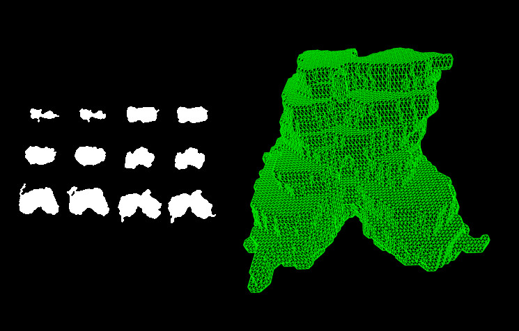
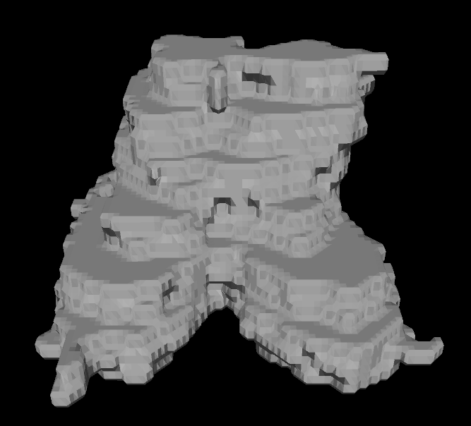
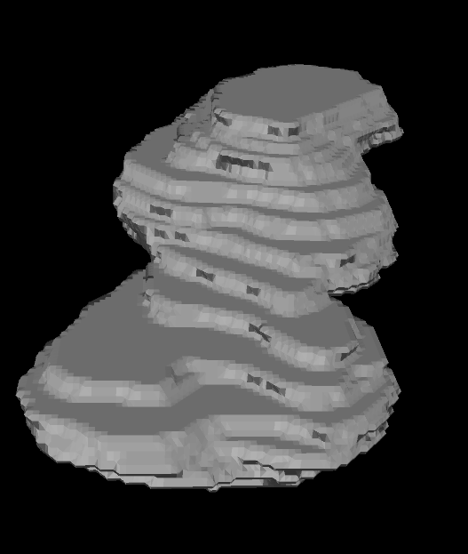
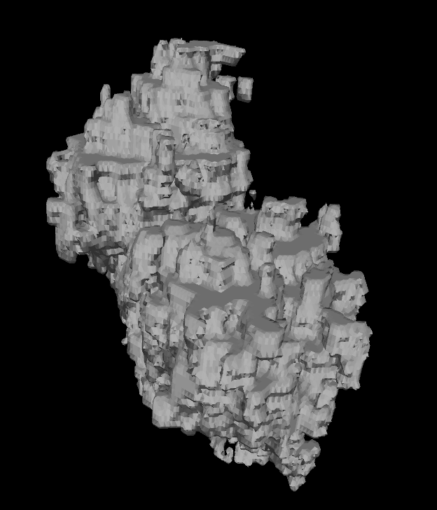
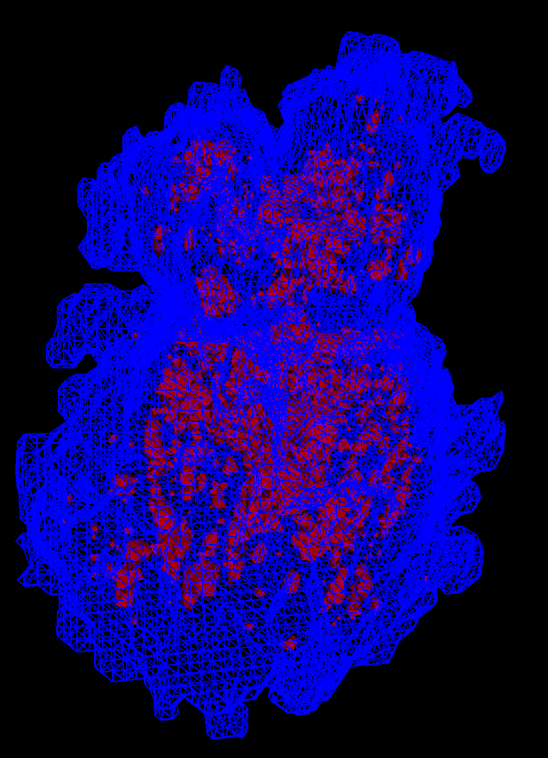

# marchingcubes

MIT License

Copyright (c) 2013-2021 Sherman Lo

A *Java/Processing* implementation of the marching cubes algorithm, including
normal averaging [[cite]](http://paulbourke.net/geometry/polygonise/). A
sequence of binary `.png` files can be provided to show a 3D render of the
resulting polygon.



## How to Use

**IMPORTANT**:

- *Java* 8 is recommended as the latest *Java* versions are not compatible
  [[for example]](https://stackoverflow.com/questions/59217351/exception-while-setting-up-jogl-with-intellij).

Download the `.jar` file from the release or compile it using the instructions
below. Call the `.jar` file using

```shell
java -jar marchingcubes-*-jar-with-dependencies.jar -file [FILE_NAME] [N_IMAGES]
```

where `FILE_NAME` is the location of the mage sequence and any other prefixes of
the `.png` files. Two digits and `.png` are appended to the file name. For
example, providing `x/y` will search for the files `x/y00.png`, `x/y01.png` and
so on. The parameter `N_IMAGES` is an integer, the number of images in the image
sequence.

Use the mouse (click, drag, scroll) to move the camera. Push the space bar to
toggle the wire frame render.

*Issues*:

- An error may occur when exiting the program, this behaviour is expected. See
  discussions for further information:
  [[X11Util.Display: Shutdown]](https://discourse.processing.org/t/x11util-display-shutdown/7292),
  [[Can any one tell me why do I get this error while quitting any P3D seketch]](https://discourse.processing.org/t/can-any-one-tell-me-why-do-i-get-this-error-while-quitting-any-p3d-seketch/13800)
- The following error may occur
  `Profile GL4bc is not available on X11GraphicsDevice`. Setting
  `export _JAVA_OPTIONS="-Djogl.disable.openglcore"` does fix this. See
  discussions for further information:
  [[Profile GL4bc is not available on X11GraphicsDevice]](https://groups.google.com/g/jaer-users/c/G6mZ7EXmiYQ),
  [[Processing 3 OpenGL error when using P3D [SOLVED]
  / Applications &amp;Desktop Environments / Arch Linux Forums]](https://bbs.archlinux.org/viewtopic.php?id=268252)

## How to Compile

*Maven* required.

Clone this repository.

Go to the repository and run

```shell
mvn package
```

and the `.jar` files are located in target/.

## Demos

Demos, using SBFSEM images of a chromosome
[[cite]](https://www.science.org/doi/10.1126/sciadv.1602231?intcmp=trendmd-adv),
are provided by running

```shell
java -jar marchingcubes-*-jar-with-dependencies.jar [-option]
```

where `[-option]` can be one of the following:

### `-demo0`

26 images of size 72 x 57



### `-demo1`

28 images of size 174 x 222



### `-demo2`

59 images of size 106 x 125



### `-demo3`

- External shell (blue) created using 24 images of size 50 x 67
- Internal features (red) created using 48 images of size 101 x 134



## Apptainer

The definition file `marchingcubes.def` is provided. Build the container using

```shell
apptainer build marchingcubes.sif marchingcubes.def
```

and run it using

```shell
apptainer run [--nv] [--env _JAVA_OPTIONS="-Djogl.disable.openglcore"] /
  marchingcubes.sif -file [FILE_NAME] [N_IMAGES]
```

```shell
apptainer run [--nv] [--env _JAVA_OPTIONS="-Djogl.disable.openglcore"] /
  marchingcubes.sif [-option]
```

where `--nv` should be provided to use an Nvidia card and
`--env _JAVA_OPTIONS="-Djogl.disable.openglcore"` may be required for fix some
issues.

## References

- Bourke, P. (1994). Polygonising a scalar field (Marching Cubes).
  <http://paulbourke.net/geometry/polygonise/>. Accessed September 2013.
- Chen, B., Yusuf, M., Hashimoto, T., Estandarte, A.K., Thompson, G. and
  Robinson, I. (2017). Three-dimensional positioning and structure of
  chromosomes in a human prophase nucleus. *Science Advances*, 3(7):e1602231.
